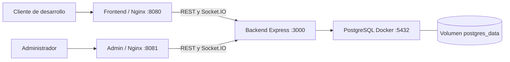
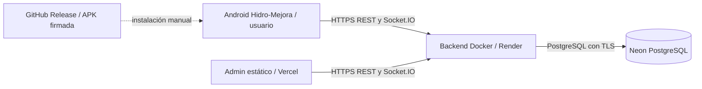

# Arquitectura de Hidro-Mejora

Referencia: código de **v1.0.0**, commit `135cb54`. La descripción no presupone sincronización de datos ni servicios adicionales.

## Desarrollo local

[compose.yaml](../compose.yaml) define `web`, `admin`, `backend` y `db`, con health checks y dependencias de salud. Nginx sirve archivos estáticos y proxy de `/api/` y `/socket.io/`, incluyendo el upgrade WebSocket. Los puertos backend y PostgreSQL no se publican al host.

El volumen lógico `postgres_data` se monta en `/var/lib/postgresql`, como requiere esta configuración PostgreSQL 18. En la instalación del proyecto Compose `sedapal` su nombre es `sedapal_postgres_data`. No cambiar la identidad del proyecto al operar un volumen existente.

## Producción

Admin se publica en Vercel; Render ejecuta el backend Node 22 y Neon conserva los datos. Android y Admin comparten la API y la base de producción. Los nombres y URLs vigentes están en [DEPLOYMENT](DEPLOYMENT.md).

PostgreSQL Docker y Neon son **bases independientes**. El código no implementa replicación ni sincronización automática; cambiar la base de API cambia el conjunto de datos consultado.

## Responsabilidades y fuentes

| Elemento | Responsabilidad |
|---|---|
| [Frontend](../Frontend/) | Interfaz del cliente, navegación, HidroBot, tutorial, gráficos y PDF. Fuente exclusiva del runtime Android. |
| [Admin](../Admin/) | Login administrativo, módulos de gestión y presentación de datos protegidos. |
| [Backend](../Backend/) | REST, validaciones, autenticación, autorización, persistencia y avisos Socket.IO. |
| [Shared](../Shared/) | Fetch con JWT/cancelación, sesiones administrativas, tiempo real reutilizable, UI, SVG y estilos. El cliente conserva su adaptador de sesión propio. |
| [Base-de-Datos](../Base-de-Datos/) | Esquema de inicialización y migraciones explícitas. |
| [android](../android/) | Contenedor Capacitor y puente propio de documentos. |
| [scripts](../scripts/) | Build, sincronización, pruebas, respaldo y diagnóstico. |
| `artifacts/` | Runtimes, APK, PDF, reportes y cachés generados, no versionados. |
| `backups/` | Recuperación privada local, no publicada. |

El modelo Java en `Backend/documentacion/java-docs/` es académico; no se ejecuta como API ni forma parte de Android.

## Comunicación y sesiones

REST es la fuente de lectura y modificación de datos. JWT se transmite en `Authorization: Bearer` y el backend reconstruye usuario, rol y suministro desde PostgreSQL. El cliente admite `usuario` y Admin admite `admin`; la protección efectiva está en la API.

Socket.IO comparte el servidor HTTP, usa `/socket.io/` y permite polling y WebSocket. Tras un evento o reconexión, el cliente vuelve a consultar REST. No existe Redis, historial persistente de eventos ni coordinación entre instancias: se mantiene una sola instancia. Contrato: [API](API.md); controles y límites: [SECURITY](SECURITY.md).

## Generación de runtimes

[scripts/build-web.js](../scripts/build-web.js) selecciona fuentes y genera `hm-api-config.js` desde la variable pública `API_BASE_URL`:

| Destino | Fuente | Salida predeterminada |
|---|---|---|
| `web` | Frontend y subconjunto Shared | `artifacts/web/client` |
| `admin` | Admin, Shared y cliente Socket.IO local | `artifacts/web/admin` |
| `android` | Frontend y subconjunto Shared | `artifacts/android/web-runtime` |

Las fuentes locales mantienen base vacía para usar rutas relativas vía Nginx. El runtime Android se genera en staging vacío y se comprueba antes del reemplazo. `sync-android.cjs` sincroniza Capacitor conservando rollback de recursos hasta verificar el resultado. No copia Admin, archivos privados, Dockerfiles ni SQL.

Las dependencias exactas se fijan en ambos `package-lock.json`; sus manifiestos utilizan rangos. Capacitor mantiene una única configuración fuente, [capacitor.config.js](../capacitor.config.js); los JSON nativos son generados. Firma y versión publicada: [ANDROID-RELEASE](ANDROID-RELEASE.md).
