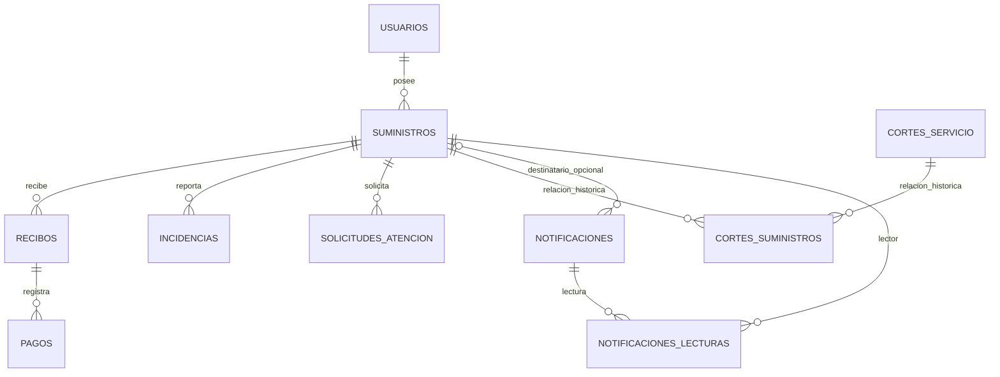

# PostgreSQL: esquema y migraciones

Fuente: [init.sql](../Base-de-Datos/init.sql) y [migraciones](../Base-de-Datos/migrations/) de **v1.0.0**, commit `135cb54`. Esta guía describe estructura, no conteos actuales de registros. No se consultó Neon ni la base local durante la actualización documental.

## Tablas y columnas

`BIGSERIAL` crea un identificador BIGINT con secuencia; las columnas PK son no nulas. Los tipos y restricciones siguientes corresponden al SQL, sin inferir reglas de aplicación como restricciones adicionales.

| Tabla | Propósito y columnas |
|---|---|
| `usuarios` | `id_usuario BIGSERIAL` PK; `correo VARCHAR(120)` UNIQUE NOT NULL; columna de credencial derivada `clave_hash VARCHAR(255)` NOT NULL (nunca exponer su valor); `rol VARCHAR(20)` NOT NULL, default usuario; `activo BOOLEAN` NOT NULL, default true; `fecha_registro TIMESTAMP`, default CURRENT_TIMESTAMP. |
| `suministros` | `id_suministro BIGSERIAL` PK; `numero_suministro VARCHAR(20)` UNIQUE NOT NULL, CHECK nueve dígitos; `id_usuario BIGINT` NOT NULL FK; `distrito VARCHAR(100)` y `zona VARCHAR(150)` opcionales. |
| `recibos` | `id_recibo BIGSERIAL` PK; `id_suministro BIGINT` NOT NULL FK; `periodo VARCHAR(20)`, emisión/vencimiento DATE, monto/consumo NUMERIC(10,2), estado VARCHAR(20), todos NOT NULL. |
| `pagos` | `id_pago BIGSERIAL` PK; `id_recibo BIGINT` NOT NULL FK; `monto NUMERIC(10,2)` NOT NULL; `metodo VARCHAR(30)`, `codigo_operacion VARCHAR(100)` opcionales; `fecha_pago TIMESTAMP`, default CURRENT_TIMESTAMP. |
| `incidencias` | `id_incidencia BIGSERIAL` PK; `id_suministro BIGINT` NOT NULL FK; tipo VARCHAR(80)/descripción TEXT NOT NULL; referencia VARCHAR(200), latitud/longitud NUMERIC(10,7), foto BYTEA y MIME VARCHAR(50) opcionales; estado VARCHAR(30) NOT NULL default Registrada; registro TIMESTAMP default CURRENT_TIMESTAMP. |
| `cortes_servicio` | `id_corte BIGSERIAL` PK; `motivo VARCHAR(200)` NOT NULL; alcance VARCHAR(20), distrito VARCHAR(80), zona VARCHAR(120), inicio/fin TIMESTAMPTZ opcionales; cancelado BOOLEAN NOT NULL default false. Columnas históricas `fecha DATE`, `hora VARCHAR(30)`, `estado VARCHAR(20)`, opcionales. |
| `cortes_suministros` | PK compuesta `id_corte`, `id_suministro`, ambos BIGINT NOT NULL y FK. Relación N:M histórica, conservada por compatibilidad. |
| `solicitudes_atencion` | `id_solicitud BIGSERIAL` PK; `id_suministro BIGINT` NOT NULL FK; categoría VARCHAR(80), asunto VARCHAR(150), descripción TEXT y estado VARCHAR(20) NOT NULL; estado default Registrada; respuesta TEXT opcional; registro/actualización TIMESTAMPTZ NOT NULL default CURRENT_TIMESTAMP. |
| `notificaciones` | `id_notificacion BIGSERIAL` PK; `id_suministro BIGINT` nullable FK; alcance VARCHAR(20) NOT NULL default Usuario; título VARCHAR(150), mensaje TEXT y tipo VARCHAR(40) NOT NULL; tipo default general; `leida BOOLEAN` NOT NULL default false, heredada; registro TIMESTAMPTZ NOT NULL default CURRENT_TIMESTAMP. |
| `notificaciones_lecturas` | PK compuesta `id_notificacion`, `id_suministro`, ambos BIGINT NOT NULL y FK; `fecha_lectura TIMESTAMPTZ` NOT NULL default CURRENT_TIMESTAMP. Presencia de fila significa leída por ese suministro. |

No existen columnas de nombre completo o teléfono en `usuarios`, ni una tabla de tarifas, lecturas de medidor o transacciones bancarias.

## Restricciones y reglas reales

Las diez PK se llaman automáticamente `<tabla>_pkey` en las ocho tablas con BIGSERIAL; las otras son `pk_cortes_suministros` y `pk_notificaciones_lecturas`. Los UNIQUE son `usuarios_correo_key` y `suministros_numero_suministro_key`.

| CHECK | Condición |
|---|---|
| `chk_rol_usuario` | rol en usuario/admin. |
| `chk_numero_suministro_9` | número coincide con `^[0-9]{9}$`. |
| `chk_estado_recibo` | Emitido, Pendiente, Pagado, Vencido o Anulado. |
| `chk_estado_incidencia` | Registrada, En revisión o Resuelta. |
| `chk_alcance_corte` | null, Zona o General. |
| `chk_estado_corte` | null, Programado, En proceso o Restablecido; columna histórica. |
| `chk_estado_solicitud` | Registrada, En atención, Respondida o Cerrada. |
| `chk_alcance_notificacion` | Usuario o General. |

FK: `fk_suministro_usuario`, `fk_recibo_suministro`, `fk_pago_recibo`, `fk_incidencia_suministro`, `fk_cs_corte`, `fk_cs_suministro`, `fk_solicitud_suministro`, `fk_notificacion_suministro`, `fk_lectura_notificacion` y `fk_lectura_suministro`.

Solo las dos FK de `notificaciones_lecturas` declaran `ON DELETE CASCADE`. Las demás usan la acción por defecto, NO ACTION. La API no ofrece operaciones DELETE.

La API verifica monto/consumo y fechas, periodo duplicado, foto y coherencia de ciertas operaciones; **no todos esos controles son CHECK/UNIQUE SQL**. No hay UNIQUE para un usuario con un solo suministro, un pago por recibo, código de operación ni suministro/periodo. El SQL permite relaciones 1:N en esos casos; el flujo de login toma un suministro con LIMIT 1 y el pago bloquea el recibo para impedir repetirlo en el flujo actual.

El alcance de notificación no tiene un CHECK SQL que obligue id_suministro para Usuario o null para General; la función interna del backend aplica esa correspondencia. No confundirla con una garantía del esquema.

## Relaciones

Las relaciones corresponden a las FK existentes. El corte operativo vigente usa alcance General o coincidencia distrito/zona, no nuevas asociaciones en la tabla histórica.

## Índices y secuencias

El esquema fuente genera **17 índices**: diez de PK, dos de UNIQUE y cinco explícitos:

- `idx_solicitudes_suministro` sobre solicitudes_atencion.id_suministro.
- `idx_solicitudes_estado` sobre solicitudes_atencion.estado.
- `idx_notif_suministro` sobre notificaciones.id_suministro.
- `idx_notif_fecha` sobre notificaciones.fecha_registro DESC.
- `idx_lecturas_suministro` sobre notificaciones_lecturas.id_suministro.

Las ocho secuencias son `usuarios_id_usuario_seq`, `suministros_id_suministro_seq`, `recibos_id_recibo_seq`, `pagos_id_pago_seq`, `incidencias_id_incidencia_seq`, `cortes_servicio_id_corte_seq`, `solicitudes_atencion_id_solicitud_seq` y `notificaciones_id_notificacion_seq`.

Sus valores son datos operativos, no constantes del proyecto. Un conteo de restricciones de catálogo depende también de la representación de NOT NULL de la versión PostgreSQL; no se publica aquí un resultado de catálogo no consultado en esta fase.

## Inicialización y migraciones

Compose monta `init.sql` de solo lectura como `01-init.sql` en el entrypoint PostgreSQL. **Se ejecuta únicamente al inicializar un directorio de datos vacío**. No es idempotente para una base ya creada y no migra automáticamente el volumen existente. `seed.sql` es privado, ignorado y no montado por Compose; no se presupone contenido ni se distribuye con el repositorio.

| Migración | Efecto y precaución |
|---|---|
| [001_notificaciones_lecturas.sql](../Base-de-Datos/migrations/001_notificaciones_lecturas.sql) | Añade tabla/PK/FK/índice de lecturas si faltan; copia marcas antiguas Usuario con suministro mediante INSERT ON CONFLICT DO NOTHING. No migra lecturas generales antiguas, porque no identifica al lector. |
| [002_suministro_9_digitos.sql](../Base-de-Datos/migrations/002_suministro_9_digitos.sql) | Añade CHECK si falta; falla si filas existentes no cumplen nueve dígitos. No modifica ni trunca esos números. |

Ambas están diseñadas para repetición controlada. No existe un runner ni tabla de historial de migraciones; Compose no las aplica automáticamente. Una base nueva ya incluye sus estructuras en init.sql. Revisar el esquema y un respaldo antes de aplicar a una base antigua, en orden 001 → 002 y con revisión de errores. No ejecutar cambios SQL durante pruebas de lectura.

## Datos, fotos y fechas

Las fotos se guardan con MIME y BYTEA, y se sirven solo por endpoints autorizados. Los listados contienen `tiene_foto`, no sus bytes. Un respaldo PostgreSQL custom incluye BYTEA y secuencias; una restauración de copia debe verificarlos, no solo contar tablas.

DATE no tiene zona; el validador de recibos conserva `YYYY-MM-DD`. TIMESTAMP de usuarios/pagos/incidencias no guarda zona, mientras otros eventos usan TIMESTAMPTZ. La UI presenta fechas en America/Lima; no asumir que eso corrige retrospectivamente un TIMESTAMP sin zona. No se cambia la política de timestamps históricos en esta documentación.

Desarrollo y Neon son independientes. Procedimiento de respaldo/restauración y comparación: [MAINTENANCE](MAINTENANCE.md). No se incluyen cuentas, correos, fotografías, hashes de credencial ni dumps en estas guías.
